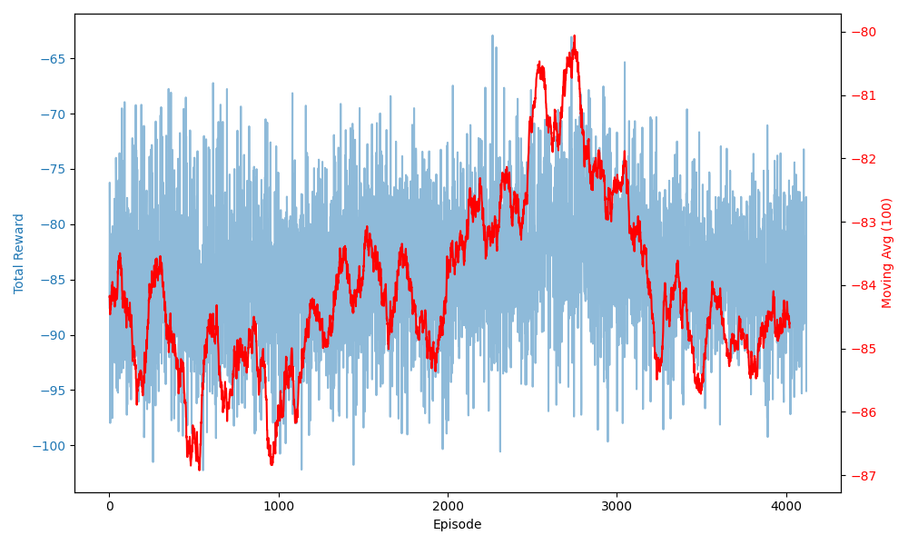

# Homework 3 Report: Vanilla Policy Gradient (REINFORCE)

## Introduction

In this homework, we aim to train a robot to push an object to a desired position using reinforcement learning methods. The primary focus of this task is to implement and train a Vanilla Policy Gradient (REINFORCE) model as well as Actor Critic Model. I used gymnasium environment for fast training.
- You can visualize succesfull and failed examples in `videos` folder.
  
## Approach: Vanilla Policy Gradient (REINFORCE)

REINFORCE is a Monte Carlo policy gradient method that optimizes a parameterized policy by following the gradient of expected return. The policy is updated based on the cumulative rewards obtained during each episode. The following components are crucial for the algorithm:

- **Policy Network:** Uses a neural network to predict the mean and standard deviation of the action distribution.
- **Sampling Actions:** Uses the predicted distribution to sample actions, introducing stochasticity in exploration.
- **Policy Update:** Uses the log-probability of the taken action and the obtained reward to update the policy.

## Implementation Details

- **Network Architecture:** The policy network consists of fully connected layers with ReLU activations, predicting both the mean and standard deviation of the action distribution.
- **Optimizer:** Adam optimizer with a learning rate of `5e-5`.
- **Discount Factor (Gamma):** Set to `0.95` to balance immediate and future rewards.
- **Action Sampling:** The action is sampled from a Gaussian distribution whose mean and standard deviation are predicted by the network.

## Experimental Results

We ran four sets of experiments:

### Experiment 1: Learning Rate = 1e-3

- **Episodes:** 1500+
- **Observation:** The agent failed to learn; rewards remained low and noisy.
- 

### Experiment 2: Learning Rate = 1e-4

- **Episodes:** 700
- **Observation:** Rewards began improving around episode 500 but then declined again.
- 

### Experiment 3: Learning Rate = 1e-4 (continued to 2000 episodes)

- **Episodes:** 2000+
- **Observation:** Initial upward trend gave way to instability; no sustained improvement.
- 

### Experiment 4: REINFORCE + Baseline (Advantage)

- **Modification:** Introduced a running baseline (mean of past episode returns) and used advantages = (return – baseline) in the policy gradient.
- **Episodes:** 10 000 then increased to 500 000
- **Observation:** Learning became stable—both raw returns (blue) and 100‑episode moving average (red) rise smoothly and plateau at higher values, with far less variance.

## Visualizing the results

- You can visualize what model learned by running `trained.py` it shows what best model learned on gymnasium environment.
- You can visualize succesfull and failed examples in `videos` folder.

# Soft Actor–Critic with GAE (Actor-Critic)

In addition to REINFORCE, I also implemented an off-policy actor–critic (SAC) augmented with Generalized Advantage Estimation (GAE).

### Algorithm Details

- **Policy (Actor):** GaussianPolicy network predicting mean & log-std, followed by a tanh squashing.
- **Critics (Twin Q):** Two Q-networks to mitigate positive bias.
- **Value network:** Vθ(s) with a soft target V̄θ for bootstrapping.
- **GAE (λ=0.95):** Compute advantages from stored transitions.
- **Replay buffer:** 1 000 000 capacity, sample-and-update every step.

### Hyperparameters

| Parameter               | Value        |
|-------------------------|--------------|
| γ (discount)            | 0.99         |
| τ (target update rate)  | 0.005        |
| α (entropy weight)      | 0.2          |
| lr (π)                  | 5 × 10⁻⁵     |
| lr (Q₁ & Q₂)            | 5 × 10⁻⁴     |
| lr (V)                  | 5 × 10⁻⁴     |
| hidden layers           | [256, 256]   |
| batch size              | 256          |
| λ (GAE)                 | 0.95         |
| max steps/episode       | 200          |
| episodes                | 50 000       |
| log interval            | 1000 ep      |

## Results
I ran 4 000 episodes (of the planned 50 000) with no noticeable improvement over a random policy—returns hovered around –85 and the 100-episode moving average stayed flat:

